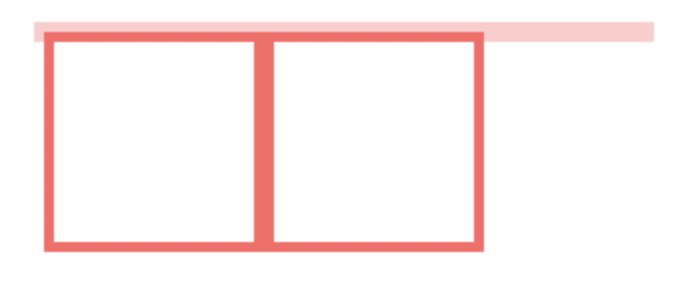

# BFC

## 概念
全称Block Formatting Context，它决定了**元素如何对其内容**进行定位，以及与其他元素的关系和相互作用。
具有BFC特性的元素可以看做是隔离了的独立容器，容器里面的元素不会在布局上影响到外面的元素。

### BFC布局规则
1. 内部的Box会在垂直方向，一个接一个地放置。
2. Box**垂直方向**的距离由margin决定。属于同一个BFC的两个相邻Box的margin会发生重叠
3. 每个元素的margin box的左边， 与包含块border box的左边相接触(对于从左往右的格式化，否则相反)。即使存在浮动也是如此。
4. BFC的区域不会与float box重叠。
5. BFC就是页面上的一个隔离的独立容器，容器里面的子元素不会影响到外面的元素。反之也如此。
6. 计算BFC的高度时，浮动元素也参与计算

### 怎么产生BFC?
1. body 根元素
2. float属性不为none
3. position为absolute或fixed
4. display为inline-block, table-cell, table-caption, flex, inline-flex
5. overflow不为visible


### 几个例子

#### 1. 布局规则3的运用
```css
<style>
    .wrapper {
        width: 300px;
        position: relative;
    }
 
    .aside {
        width: 100px;
        height: 150px;
        float: left;
        background: #f66;
    }
 
    .main {
        height: 200px;
        background: #fcc;
    }
</style>
<div class='wrapper'>
    <div class="aside"></div>
    <div class="main"></div>
</body>
```

<style>
    .wrapper {
        width: 300px;
        position: relative;
        overflow: hidden;
    }

    .aside {
        width: 100px;
        height: 150px;
        float: left;
        background: #f66;
    }

    .main {
        height: 200px;
        background: #fcc;
    }
</style>
<div class='wrapper'>
    <div class="aside"></div>
    <div class="main"></div>
</div>  

#### 2. 规则4的运用
假如我们想让上面的main和aside box不重叠，我们把main变成BFC box， 如下所示
```css
<style>
    .wrapper {
        width: 300px;
        position: relative;
        overflow: hidden;
    }

    .aside {
        width: 100px;
        height: 150px;
        float: left;
        background: #f66;
    }

    .main {
        height: 200px;
        background: #fcc;
        overflow: hidden;
    }
</style>
<div class='wrapper'>
    <div class="aside"></div>
    <div class="main"></div>
</div>
```

<style>
    .wrapper2 {
        width: 300px;
        position: relative;
        overflow: hidden;
    }

    .aside2 {
        width: 100px;
        height: 150px;
        float: left;
        background: #f66;
    }

    .main2 {
        height: 200px;
        background: #fcc;
        overflow: hidden;
    }
</style>
<div class='wrapper2'>
    <div class="aside2"></div>
    <div class="main2"></div>
</div>

#### 3. 规则6的运用，清楚内部浮动

```css
<style>
    .par {
        border: 5px solid #fcc;
        width: 300px;
    }
 
    .child {
        border: 5px solid #f66;
        width:100px;
        height: 100px;
        float: left;
    }
</style>
<div class="par">
    <div class="child"></div>
    <div class="child"></div>
</div>
```


在非BFC box里面，float box是不参与高度计算的，所以我们看到par的高度是坍缩的。

要让float box参与高度计算，可以将par变为BFC。 如下所示

```css
<style>
    .par {
        border: 5px solid #fcc;
        width: 300px;
    }
 
    .child {
        border: 5px solid #f66;
        width:100px;
        height: 100px;
        float: left;
    }
</style>
<div class="par">
    <div class="child"></div>
    <div class="child"></div>
</div>
```


## Reference
https://www.cnblogs.com/chakson/p/4972286.html