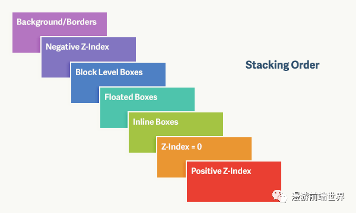
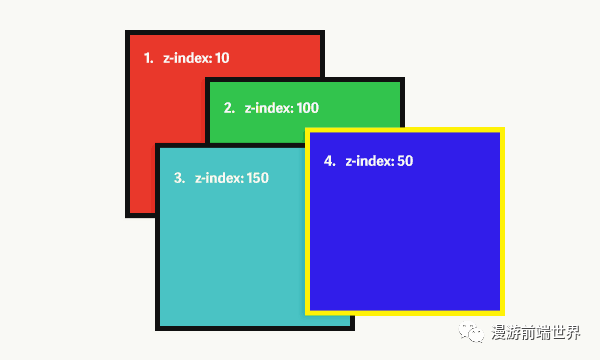

# z-index

z-index 这个属性表面看上去很简单，但如果你想搞清楚其工作原理的话，其实是有不少值得探讨之处的。本文将从层叠上下文（stacking contexts）和一些实际案例出发，谈一谈 z-index 的内部工作原理。

对于新手而言，我们可能简单的任务z-index越大，那么该元素就应该在最上面。所以有的时候，我们可以看到很多人为了快速解决一个问题，直接把z-index设成10000。但是有的时候让我们惊讶的是，它并不生效。

汇总一些特殊情况如下：
- 当设置了定位和 z-index 的元素与一个位于正常文档流中的元素重叠时，哪一个在顶层呢？
- 一个元素设置定位，另一个元素设置浮动，哪一个在顶层呢？
- 如果父元素和子元素都设置了定位，会发生什么事？

为了回答上面的问题，我们需要理解具体的工作原理，主要是3个概念：
**层叠上下文、层叠等级和层叠顺序**

### 层叠上下文
就好像一个房子里，有桌子和椅子。桌子上物品的高低顺序，与椅子上的物品高低顺序，并不是一个强关系。椅子上最高的物品，极有可能是比桌子上最低的物品还要低。  
同样的道理，在CSS中，不同的元素在一定条件下会形成自己的层叠上下文，这个时候比较他们的z-index，就不能单纯的比较数值了。

### 层叠等级
在同一个层叠上下文中，不同的元素他们默认的层叠等级不一样。譬如body连有一个div元素，div默认就是在body之上的。 

在一个层叠上下文中，可能会出现7个层叠等级。 
1. 背景和边框 ：形成层叠上下文的元素的背景和边框，它是整个上下文中层叠等级最低的。
2. Z-Index 为负数 ：设置了 z-index 为负数的子元素以及由它所产生的层叠上下文
3. 块级盒模型：位于正常文档流中的、块级的、非定位的子元素
4. 浮动盒模型 ：浮动的、非定位的子元素
5. 内联盒模型 ：位于正常文档流中的、内联的、非定位的子元素
6. Z-index 为 0：设置了 z-index 为 0 的、定位的子元素以及由它所产生的层叠上下文
7. Z-Index 为正数 ：设置了 z-index 为正数的、定位的子元素以及由它所产生的层叠上下文，它是整个上下文中层叠等级最高的



有了上面的理解之后，我们来看一个例子：

```
<div class="one">
  <div class="two"></div>
  <div class="three"></div>
</div>
<div class="four"></div>
```

```
div {
  width: 200px;
  height: 200px;
  padding: 20px;
}
 
.one, .two, .three, .four {
  position: absolute;
}
  
.one {
  background: #f00;
  outline: 5px solid #000;
  top: 100px;
  left: 200px;
  z-index: 10;
}
  
.two {
  background: #0f0;
  outline: 5px solid #000;
  top: 50px;
  left: 75px;
  z-index: 100;
}
 
.three {
  background: #0ff;
  outline: 5px solid #000;
  top: 125px;
  left: 25px;
  z-index: 150;
}
 
.four {
  background: #00f;
  outline: 5px solid #ff0;
  top: 200px;
  left: 350px;
  z-index: 50;
}
```

展示的顺序如下  


由于 div.two， div.three  位于 div.one 中，所以它的 z-index 是和 div.one 的层叠上下文相关的，也就是说，实际表现出来的 z-index 是下面这样的：

.one —— z-index = 10  
.two —— z-index = 10.100  
.three —— z-index = 10.150  
.four —— z-index = 50

所以比较的时候会优先比较权位更重的z-index数值。

我们平时开发的时候，比较两个元素的显示顺序时。如果出现z-index较大的反而不能覆盖较小的z-index的时候，我们首先要分析他们在不在同一个层叠上下文中。如果不在，那么就要往父级元素寻找，一直找到在同一个层级上下文里面，然后再进行比较。


## Reference 
[关于 z-index，你可能一直存在误区](https://mp.weixin.qq.com/s/XyRFMdVkPcOvMxDDeHFyiQ?st=9B8371489B6F3F9905490D2EB55F1F8F4ABD8508FA588F8EAE35F2ABE002192884422F968F6077C97A859FF70AA00A929744405DFBBE49DBF4D6AD80E9121AC65A6985DE8E9FFDFC5E247174BB726A71C564DD9CB449A4C7D262AD20DB043CC8AD14DCA3AD4FEA4489D482536F800312EAC4B805ED2E6FBC2B652314B21A4A48CB3E2938F83892C0387CB5C21FEACFB85A0D3618C8D167175BFA19310836B836BD1AA0B99E4FCB50E32ACD7AC525261C575DECD8DEE60822511079BDD0CB61D7B1C1E9BCAF6A3E7C997A0C404E11C4EA&vid=1688853128029119&cst=386F8073842A981F2FDDB9F725C15F62B6535C5599F31AA94F91601048E6A019A0DBF5E0B855E7B992611CAA77B27EC1&deviceid=6e70059e-a97e-41b9-a52e-974c69068038&version=3.1.23.90391&platform=mac)