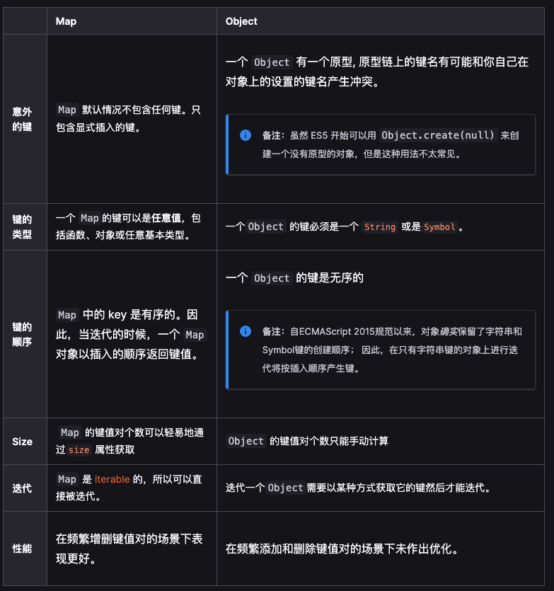

## Map vs Object



## WeakMap vs Map
WeakMap引入了弱引用的概念
> 在计算机程序设计中，弱引用与强引用相对，是指不能确保其引用的对象不会被垃圾回收器回收的引用。一个对象若只被弱引用所引用，则被认为是不可访问（或弱可访问）的，并因此可能在任何时刻被回收。

强引用的例子：
```
let map = new Map();
let key = new Array(5 * 1024 * 1024);

// 建立了 map 对 key 所引用对象的强引用
map.set(key, 1);
// key = null 不会导致 key 的原引用对象被回收
key = null;
```

如果我们把上面的Map改为使用WeakMap，那么key所用的数组会被垃圾回收掉。

#### WeakMap只接受对象作为键名
```
const map = new WeakMap();
map.set(1, 2);
// TypeError: Invalid value used as weak map key
map.set(null, 2);
// TypeError: Invalid value used as weak map key
```

#### 一个比较适合的应用场景
在做对象的深拷贝的时候，我们需要检查循环引用的问题。这个时候我们可以把已经复制的对象存到WeakMap中，对于已经完成拷贝的对象，直接从WeakMap中把值取出。等到深拷贝完成时，如果我们销毁被拷贝的对象，那么这个WeakMap中的内容就会被全部回收。