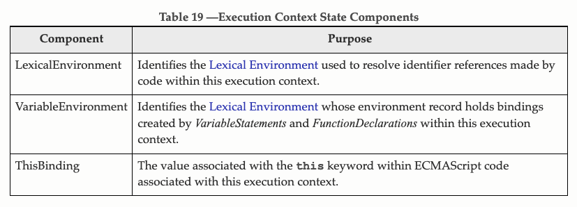

# 执行上下文

## ES6 [10.3章节](https://262.ecma-international.org/5.1/#sec-10.3)里的定义
> When control is transferred to ECMAScript executable code, control is entering an execution context. Active execution contexts logically form a stack. The top execution context on this logical stack is the running execution context. A new execution context is created whenever control is transferred from the executable code associated with the currently running execution context to executable code that is not associated with that execution context. The newly created execution context is pushed onto the stack and becomes the running execution context.

大意是，当执行一段JS代码(全局代码或函数)的时候，会创建一个执行上下文。就好像函数调用会形成一个调用栈，执行上下文也会形成一个栈。在最上面的就是当前的执行上下文。

执行上下文里面包括三个部分：  

LexicalEnvironment: 里面会保存let/const定义的变量  
VariableEnvironment: 里面会保存var和定义的函数  
ThisBinding: this指向 