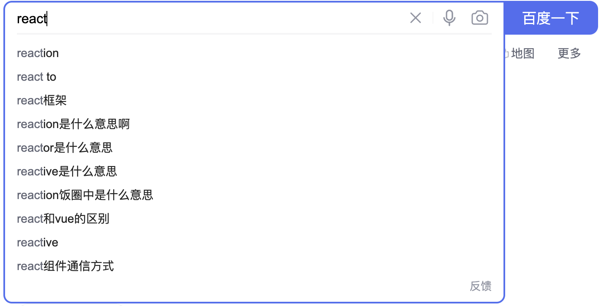

## 并发模式是如何工作的？

### React为什么需要并发？
前端应用需要处理越来越复杂的UI, 尤其是数据可视化这样的应用。一次render可能会占用很长时间，如果不引入并发的话，在render的过程中用户的操作得不到响应，会让用户产生卡顿的感觉。


### JS如何实现并发？
想想后端语言是如何实现并发的，用的是多线程。CPU分配了时间切片，被分配了时间切片的线程利用CPU执行逻辑。多线程就可以同时处理多个任务了。   

JS语言是单线程，无法使用多线程技术，所以就需要想方法如何用好单线程。这里的单线程其实就像CPU，我们要执行的任务对应多线程语境下的每个线程上的任务。

要实现并发需要解决两个问题：
- 第一个是任务可中断  
任务的中断，我们可以考虑计时执行，执行时间片用完之后，就把任务加到priority queue里面

- 第二个是任务可以切换。   
通过JS的异步调用，把清空队列任务的逻辑放入到宏任务里面，供以后执行。这个时候就可以响应这个时间切片里面积攒的用户的操作。  


接下来我们来看看React具体是怎么来解决这两个问题的？
### Fiber架构
对于第一个问题，React采用Fiber架构，来使reconcile的过程可中断。
在Fiber架构之前，React的virtual dom数据结构是树，通过递归树的方式来收集diff。这个过程我们也叫stack reconcile。stack reconcile是无法中断的，所以需要引入可中断的架构。

接下来我们具体来看看Fiber架构是如何达到reconcile过程可中断的目的的。 

```javascript
function FiberNode(
  tag: WorkTag,
  pendingProps: mixed,
  key: null | string,
  mode: TypeOfMode,
) {
  // Instance
  this.tag = tag; // 3 为 HostRoot
  this.key = key;
  this.elementType = null;
  this.type = null;
  this.stateNode = null;

  // Fiber
  this.return = null;
  this.child = null;
  this.sibling = null;
  this.index = 0;

  this.ref = null;

  this.pendingProps = pendingProps;
  this.memoizedProps = null;
  this.updateQueue = null;
  this.memoizedState = null;
  this.dependencies = null;

  this.mode = mode;

  // Effects
  this.flags = NoFlags;
  this.nextEffect = null;

  this.firstEffect = null;
  this.lastEffect = null;

  this.lanes = NoLanes;
  this.childLanes = NoLanes;

  this.alternate = null;
 }
```
这是FiberNode节点的数据结构，virtual dom是由多个这样的节点组合而成。FiberNode上面有child, sibling, return三个指针
- child： 指向第一个child节点
- sibling: 指向右边的兄弟节点
- return： 指向父亲节点。

由此可以就组成了一个类似链表的数据结构，于是就可以进行顺序遍历。没处理一个节点之前，都需要判断是否时间片的deadline已经到了。如果已经达到了，则中断该任务。

```javascript
function workLoopConcurrent() {
  // Perform work until Scheduler asks us to yield
  while (workInProgress !== null && !shouldYield()) {
    performUnitOfWork(workInProgress);
  }
}

exports.shouldYield = function () {
  return exports.unstable_now() >= deadline;
}
```


我们接下来看React是如何把中断的任务放入到queue中的。  

React通过unstable_scheduleCallback函数来实现这个操作的。   

这里我们可以看到有两个queue, 这两个queue都是小顶堆的数据结构
- timeerQueue  
startTime > currentTime的任务会被放入这个queue中，这个queue里是根据startTime来排列的。每次从里面取任务的时候都是取startTime最小的
- taskQueue  
startTime < currentTime的任务会被放入这个queue中, 这几个queue是根据expirationTime来排列的。每次从里面去expirationTime最小的任务，即过期最久的任务第一个被执行。

```javascript
// packages/scheduler/src/Scheduler.js
function unstable_scheduleCallback(priorityLevel, callback, options) {
  var currentTime = getCurrentTime();
  var startTime; 
  // 根据option赋值startTime

  //根据priortiy赋值不同的timeout 
  var timeout;
  //...

  var expirationTime = startTime + timeout;

  var newTask = {
    id: taskIdCounter++,
    callback,
    priorityLevel,
    startTime,
    expirationTime,
    sortIndex: -1,
  };
  if (enableProfiling) {
    newTask.isQueued = false;
  }

  if (startTime > currentTime) {
    // This is a delayed task.
    newTask.sortIndex = startTime;
    push(timerQueue, newTask); //若任务开始执行时间是在以后，把任务放到timerQueue
    if (peek(taskQueue) === null && newTask === peek(timerQueue)) {
      // All tasks are delayed, and this is the task with the earliest delay.
      if (isHostTimeoutScheduled) {
        // Cancel an existing timeout.
        cancelHostTimeout();
      } else {
        isHostTimeoutScheduled = true;
      }
      // Schedule a timeout.
      requestHostTimeout(handleTimeout, startTime - currentTime);
    }
  } else {
    newTask.sortIndex = expirationTime;
    push(taskQueue, newTask); // 任务的开始时间已经过了，把其推到taskQueue里面
    //...
    // Schedule a host callback, if needed. If we're already performing work,
    // wait until the next time we yield.
    if (!isHostCallbackScheduled && !isPerformingWork) {
      isHostCallbackScheduled = true;
      requestHostCallback(flushWork);
    }
  }

  return newTask;
}
```

至此我们了解了任务可中断是如何实现的。接下来我们看看不同任务之间是如何切换的。


### 任务切换
在了解任务切换之前，我们需要明确哪些任务是需要切换的。
这里有两类任务
- queue里堆积的reconcile任务  
这种任务切换的实现其实非常容易，时间片执行完之后，把剩余任务放入queue中，再取出下一个任务执行即可。本质上还是一个顺序执行。

- 在一个时间片里面用户的交互操作所产生的reconcile任务  

第二种任务的解决要充分利用JS异步执行任务的特性

如下图所示，假如我们去百度里面搜索react相关的内容。假设我们输入react获得10000条结果，这个列表渲染出来需要3s。在这个时间内，我又想搜索react redux, 这个时候先前的渲染任务不应该阻塞对我这个新的搜索操作的响应。



我们再看一下上面的unstable_scheduleCallback的代码, 最后会执行requestHostCallback(flushWork)

```javascript
const channel = new MessageChannel();
const port = channel.port2;
channel.port1.onmessage = performWorkUntilDeadline;

requestHostCallback = function(callback) {
  scheduledHostCallback = callback;
  if (!isMessageLoopRunning) {
    isMessageLoopRunning = true;
    port.postMessage(null);
  }
};

var performWorkUntilDeadline = () => {
    if (scheduledHostCallback !== null) {
      const currentTime = getCurrentTime();
      // Yield after `yieldInterval` ms, regardless of where we are in the vsync
      // cycle. This means there's always time remaining at the beginning of
      // the message event.
      deadline = currentTime + yieldInterval;
      const hasTimeRemaining = true;
      try {
        const hasMoreWork = scheduledHostCallback(
          hasTimeRemaining,
          currentTime,
        );
      } 
      //...
    } 
    //...
  };
  
```

这里我们看到React使用了MessageChannel, requestHostCallback里面会调用port.postMessage，这会使得performWorkUntilDeadline被加入为下一个宏任务。那么在这个宏任务执行之前，用户的交互可能已经通过DOM事件捕捉到，并且是排在这个宏任务之前。所以用户的任务的到响应，而performWorkUntilDeadline会在响应了用户的操作之后再执行。这样React就实行了向第二种任务的切换。

### 总结
并发的本质是一样的，多线程情况下，是要让CPU能够轮流执行每个线程上的任务；单线程情况下，是要让单线程轮流执行多个任务。
这里要解决两个问题：任务可中断 + 任务可切换

解决中断问题，React使用了Fiber这样的类链表的结构  

解决任务切换问题，主要是要考虑如何让出主线程，来响应用户的交互操作。 

任务分成两种，一种是已经积攒的reconcile任务，另一种是用户的操作所产生的reconcile任务。
第一种任务的切换，从queue里面取出来执行即可。第二种任务，因为还不在queue里面，需要让出主线程，从宏任务里面把用户交互所产生的任务取出来执行。这就是为什么React需要使用MessageChannel的原因。


## Reference
- [React 的 Concurrent Mode 是否有过度设计的成分？](https://www.zhihu.com/question/434791954/answer/2453356416)  
- [Secheduler & Lane](https://xiaochen1024.com/courseware/60b1b2f6cf10a4003b634718/60b1b556cf10a4003b634727)