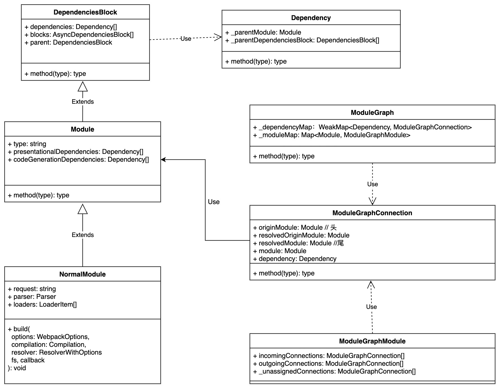

## 一个js文件的依赖是如何被Webpack解析出来的?

### 前言
最近在仔细的研究Webpack源码，因为是第一次研究，所以希望从最基本的开始。  
我们都知道webpack打包的流程是根据入口js文件，通过BFS遍历分析出所有的依赖关系，然后通过loader转译代码，最后打包并聚合成最终的bundle文件。  
这篇文章想要结合源码分析，webpack是如何根据入口文件，找出他的依赖的。
这个乍看起来似乎很简单，但是由于webpack的插件太多了，源码阅读起来非常困难，我也是花了九牛二虎之力，才理解了整个过程。


### 概念解释
- compiler: 编译器，Compiler的实例，**全局唯一**，定义了webpack整个构建流程。其提供了一系列钩子, 允许plugin在不同的时机介入 [Compiler Hooks](https://webpack.js.org/api/compiler-hooks/)
- compilation: 单次编译的管理实例，譬如在watch模式下，每次文件改动触发的编译都会创建该实例 [Compilation Hooks](https://webpack.js.org/api/compilation-hooks/)
- NormalModuleFactory: 用来生成module的类，里面也定义了一系列[hooks](https://webpack.js.org/api/normalmodulefactory-hooks/)
- JavascriptParser: javascript的parser，除了把源码转成ast之外，里面也定义了一系列[hooks](https://webpack.js.org/api/parser/)


### 解析过程
我们这里跳过前期的webpack准备工作，直接从compilation.addEntry这个函数开始，一步步看webpack是如何工作的。

addEntry -> _addEntryItem -> addModuleTree
```
addModuleTree({ context, dependency, contextInfo }, callback) {
  //...
  const Dep = /** @type {DepConstructor} */ (dependency.constructor);
  const moduleFactory = this.dependencyFactories.get(Dep);
  //...

  this.handleModuleCreation(
    {
      factory: moduleFactory,
      dependencies: [dependency],
      originModule: null,
      contextInfo,
      context
    },
    //...
  );
}
```

**问题**：这里的moduleFactoy是什么，他是什么时候被放入this.dependencyFactories里面的？
通过全局搜索，我们可以发现在EntryPlugin的apply方法，里面有操作这个字段的逻辑，如下所示
```
apply(compiler) {
  compiler.hooks.compilation.tap(
    "EntryPlugin",
    (compilation, { normalModuleFactory }) => {
      compilation.dependencyFactories.set(
        EntryDependency,
        normalModuleFactory
      );
    }
  );

  const { entry, options, context } = this;
  const dep = EntryPlugin.createDependency(entry, options);

  compiler.hooks.make.tapAsync("EntryPlugin", (compilation, callback) => {
    compilation.addEntry(context, dep, options, err => {
      callback(err);
    });
  });
}
```
由此可见moudleFactory其实就是指的normalMoudleFactory. 

我们继续看接下来的流程
addEntry -> _addEntryItem -> addModuleTree -> handleModuleCreation -> factorizeModule
这里会把入口文件塞入到factorizeQueue里面
```
this.factorizeQueue = new AsyncQueue({
    name: "factorize",
    parent: this.addModuleQueue,
    processor: this._factorizeModule.bind(this)
});
```
factorizeQueue里面定义了一个processor，这个prorcessor每次有元素加到queue里面都会执行
所以我们接下来来看_factorizeModule里面的逻辑
在这个函数里面会调用factory.create方法，这里的factory就是NormalModuleFactory
```
create(data, callback){
  this.hooks.beforeResolve.callAsync(resolveData, (err, result) => {
    //...
    this.hooks.factorize.callAsync(resolveData, (err, result) => {
      // ...
    }
  }
}
```
这里总共触发了normalMoudleFactory两个钩子beforeResolve和factorize  
我们需要看看这两个钩子之前有没有注册函数，全局搜索一下，我们发现factorize这个钩子在constructor里面注册了函数的，然后这个函数里面又触发了resolve这个钩子  
**至此我们正式进入resolve文件依赖的阶段。**

在resolve钩子函数里，会去执行defaultResolve -> resolveResource -> continueCallback -> resolveRequestArray -> continueCallback 
```
Object.assign(data.createData, {
  //...
  parser: this.getParser(type, settings.parser),
  //...
});
```
**在这里我们获得了JavascriptParser**

这个会程序执行会回调到之前this.hooks.resolve.callAsync里的callback函数，先触发afterResolve这个钩子，然后触发createModule这个钩子
```
createdModule = new NormalModule(
    /** @type {NormalModuleCreateData} */ (createData)
  );
}

createdModule = this.hooks.module.call(
  createdModule,
  createData,
  resolveData
);
```
创建了NormalModule实例后，回调到Compilaiton里的factory.create的callback函数里面，再回调到_factorizeModule的callback, 再回调到addModule的callback, 
执行_handleModuleBuildAndDependencies -> this.buildModule -> this._buildModule

继续执行NormalModule.build -> _doBuild 
```
try {
  const source = this._source.source();
  result = this.parser.parse(this._ast || source, {
    source,
    current: this,
    module: this,
    compilation: compilation,
    options: options
  });
} catch (e) {
  handleParseError(e);
  return;
}
handleParseResult(result);
```

**这里我们终于看到了把源码转成ast的地方**
我们知道parser是有钩子的，所以webpack其实在执行到这里执之前，已经把HarmonyImportDependencyParserPlugin的钩子注册好了。在解析到import语句的时候，webpack会把依赖写到parser.state.module的依赖中，这里的module就是我们上边创建的NormalModule. 如下所示：
```
parser.hooks.import.tap(
  "HarmonyImportDependencyParserPlugin",
  (statement, source) => {
    parser.state.lastHarmonyImportOrder =
      (parser.state.lastHarmonyImportOrder || 0) + 1;
    const clearDep = new ConstDependency(
      parser.isAsiPosition(statement.range[0]) ? ";" : "",
      statement.range
    );
    clearDep.loc = statement.loc;
    parser.state.module.addPresentationalDependency(clearDep);
    parser.unsetAsiPosition(statement.range[1]);
    const assertions = getAssertions(statement);
    const sideEffectDep = new HarmonyImportSideEffectDependency(
      source,
      parser.state.lastHarmonyImportOrder,
      assertions
    );
    sideEffectDep.loc = statement.loc;
    parser.state.module.addDependency(sideEffectDep);
    return true;
  }
);
```


**至此我们终于知道入口文件的依赖是如何被如何一步步被webpack解析出来了**


### 总结
从文件路径到最后把依赖分析出来，主要经过3个过程
第一步： factorizeModule, 这一步会创建出一个新的module实例，并且把实例里的parser等信息都准备好
第二步:  addModule, 这一步会把模块添加到moudleCache里面
第三部:  buildMoudle, 这一步会通过parser把module的依赖分析出来

### Reference

- Module相关的UML类图

