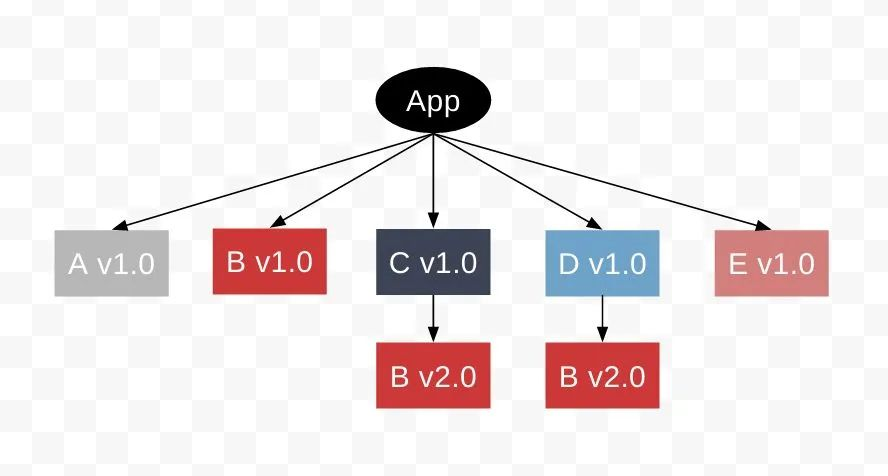

# npm | yarn | pnpm

### 上古时代 - npm3之前
npm5之前，npm安装并不是扁平化的。譬如你安装express，在node_modules只能找到express的一个文件夹。express所有的依赖都被安装在里面。

非扁平化带来很多的问题，主要有以下几点：
- 目录嵌套过深
- 模块实例无法共享，会增加最终打包体积
- 安装速度慢，需要一个模块模块的下载，无法并行 

### npm3时代
为了解决上面的问题，npm3将目录层级改为扁平化。

扁平化面对的问题是如何解决不同版本依赖的问题。譬如pkg-a依赖package-c@0.0.0, 而pkg-b依赖pkg-c@1.0.0，只能有一个放在node_modules下面，另一个则需要特殊处理。

例如我们安装顺序为pkg-a, pkg-b，安装完之后的目录如下  
```
- node_modules/
  - pkg-a/
  - pkg-c/ 0.0.0
  - pkg-b/
    - node_modules/
      - pkg-c/ 1.0.0
```
由此我们看到，pkg-c@0.0.0是安装在外面，而1.0.0则是安装在pkg-b里面的。
> 注意： 这里pkg-c哪个版本该安装在外面，是有pkg-a和pkg-b的安装顺序决定的

这里就出现了安装一致性的问题，pkg-a和pkg-b的安装顺序会影响到在根目录下的pkg-c的版本。

### yarn的诞生
随着node社区越来越大，npm3暴露出很多问题
- 无法保证两次问题相同，因为版本是用的语义化版本号
- 安装速度慢，不能并行下载和安装
- npm3不支持离线模式，每次都需要发起下载请求

为了解决这几个问题，yarn应运而生了。为了解决上面的问题，yarn做了下面三件事情
- 引入yarn.lock文件，保证每次安装都是一致的
- 允许并行下载
- 使用缓存，减少网络请求 (yarn cache dir会打印出cache的文件夹所在的位置)

### npm5
npm5之后，引入了package-lock.json文件，也允许并行下载和使用缓存，npm的大多数缺点都得到了改进，目前和yarn相比性能已经差不多了。


### 包安装待解决的问题
1. 包重复的问题没有得到根本解决。 
如下图所示，A,C,D依赖不同的B的版本，B v2.0仍然安装了两次

2. 幽灵依赖  
假如包A的devDependencies包含了B，并且A的代码中require了B，那么在A开发的时候是不会报错的。但是A发布后，使用方如果没有B的依赖，那么就会报错。
这样的依赖我们称之为幽灵依赖(Phantom Dependency)

### pnpm的诞生
为了解决上面两个问题，pnpnm又应运而生了。

pnpm会把所有安装的包都扁平化的放在global store里面。  
在项目里面会创建一个.pnpm文件夹，里面也是**扁平化**的**对所有不同版本的依赖**和**依赖的依赖**以来创建了指向globa store的硬链接。  
项目的dependencies里的包则是以软链接，**嵌套式**的放在node_modules下面。  
依赖的依赖不会放在node_modules下面，而是在根目录的父依赖中创建软链接，软链接指向.pnpm目录里面对包。

如下图所示: 


透过这样的方式，pnpm完整的保留了拓扑结构，幽灵依赖的问题得到解决。同时因为使用了硬链接指向global store, 重复安装依赖的问题也得到了解决。安装速度大为提高，磁盘占用也变小了。 


## Reference
- [https://hackernoon.com/working-of-yarn-and-npm-974b79f10341](https://hackernoon.com/working-of-yarn-and-npm-974b79f10341)

- [node_modules困境](https://z.itpub.net/article/detail/E8D5F33F58F9FF55916877DB69F9573C)  
https://mp.weixin.qq.com/s/GCfv-Hshw4N2fCKVvAi6Kg


- npm的安装及缓存机制详解
https://blog.csdn.net/qdthn/article/details/122861959

- pnpm介绍
https://zhuanlan.zhihu.com/p/549189023