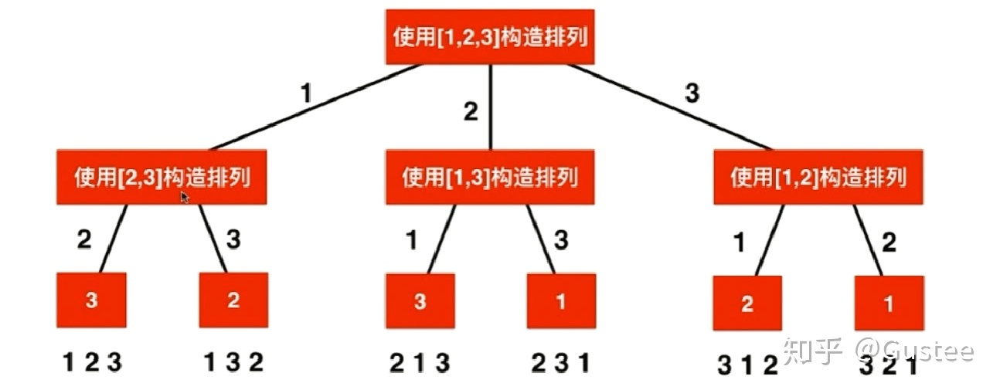

# 排列组合

## 全排列
[ 1, 2, 3] => { [1, 2, 3], [1, 3, 2], [2, 1, 3], [2, 3, 1], [3, 1, 2], [3, 2, 1] }

思路：可以通过DFS深度搜索来解。每一次向下搜索的时候，使用递归，假设剩余的数字已经排列好。把之前已经搜索好的数与剩余数字的排列组合拼接起来，就能获得我们想要的答案。



JavaScript的实现
```
function permutation(nums){
  let ans = []
  let cur = [] // 当前搜索过并存放的数字
  let used = [] // 如果这个数在cur里面，则标记为使用过
  dfs(nums, 0, ans, cur, used)
  return ans
}

function dfs(nums, depth, ans, cur, used){
  if(depth === nums.length){ //如果递归深度已经达到nums的长度，递归终止
    ans.push(cur.slice())
    return
  }
  for(let i=0; i<nums.length; i++){
    if(used[i]) continue //如果数字已经在cur里面，那么取下一个数
    used[i] = true
    cur.push(nums[i])
    dfs(nums, depth+1, ans, cur, used)
    cur.pop()
    used[i] = false
  }
}
```

## 有重复数字的全排列
[ 1, 2, 2] => { [1, 2, 2], [2, 2, 1], [2, 1, 2] }

```
function permutation(nums){
  let ans = []
  let cur = [] // 当前搜索过并存放的数字
  let used = [] // 如果这个数在cur里面，则标记为使用过
  dfs(nums, 0, ans, cur, used)
  return ans
}

function dfs(nums, depth, ans, cur, used){
  if(depth === nums.length){ //如果递归深度已经达到nums的长度，递归终止
    ans.push(cur.slice())
    return
  }
  for(let i=0; i<nums.length; i++){
    if(used[i]) continue //如果数字已经在cur里面，那么取下一个数
    if(i > 0 && nums[i] === nums[i-1] && !used[i-1]) continue // 关键：如果与前一个数相等，并且之前的数不在cur里面，那么应该跳过，不然的话就是在算重复的解。
    used[i] = true
    cur.push(nums[i])
    dfs(nums, depth+1, ans, cur, used)
    cur.pop()
    used[i] = false
  }
}
```

## 组合
从3个数中选两个数
[ 1, 2, 3] => { [1, 2], [1, 3], [2, 3] }

思路：采用深度搜索。递归的时候，下一次的递归的开始index需要增加一，避免重复的解

```
function combine(nums, d){
  let ans = [];
  let cur = [];
  dfs(nums, d, 0, ans, cur);
  return ans;
}

function dfs(nums, d, s, ans, cur){ //s为下次搜索开始的index
  if(d === 0){
    ans.push(cur.slice());
    return 
  }
  for(let i=s; i<nums.length; i++){
    cur.push(nums[i])
    dfs(nums, d-1, i+1, ans, cur)
    cur.pop()
  }
}
```


## 对有重复数字的数组进行组合
从3个数中选两个数
[ 1, 2, 2] => { [1, 2], [2, 2]}

```
function combine(nums, d){
  let ans = [];
  let cur = [];
  let used = []
  dfs(nums, d, 0, ans, cur);
  return ans;
}

function dfs(nums, d, s, ans, cur){
  if(d === 0){
    ans.push(cur.slice());
    return 
  }
  for(let i=s; i<nums.length; i++){
    if(i > s && nums[i] === nums[i-1] && !cur.includes(nums[i-1])) continue; //去重
    cur.push(nums[i])
    dfs(nums, d-1, i+1, ans, cur)
    cur.pop()
  }
}
```